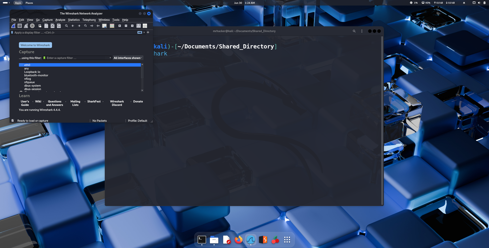
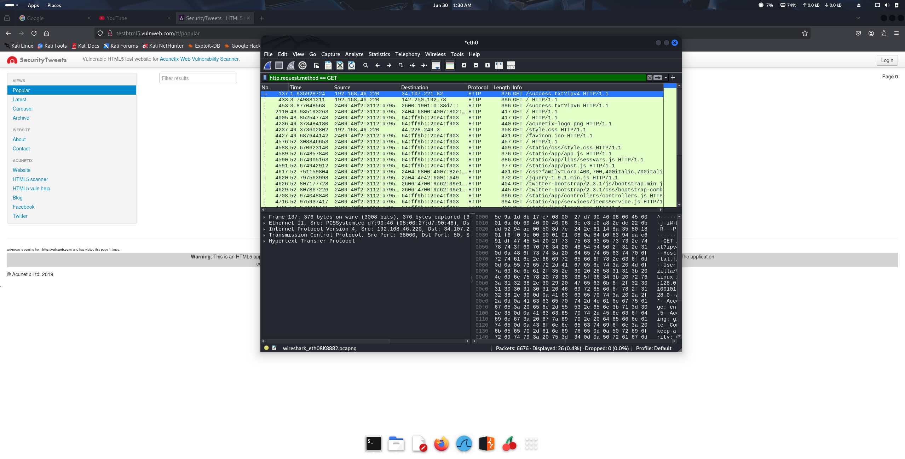
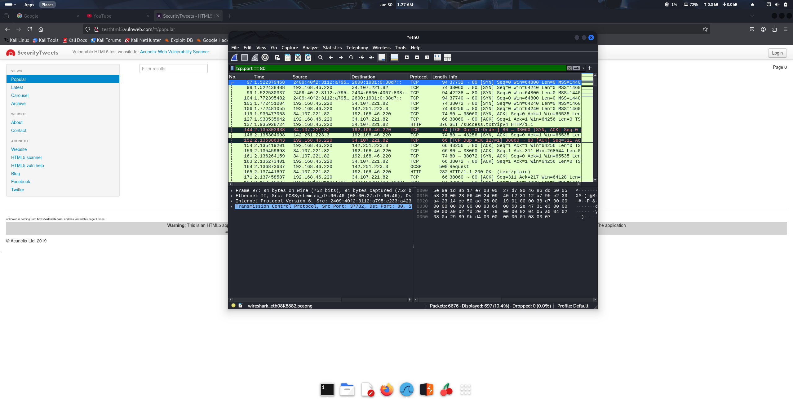
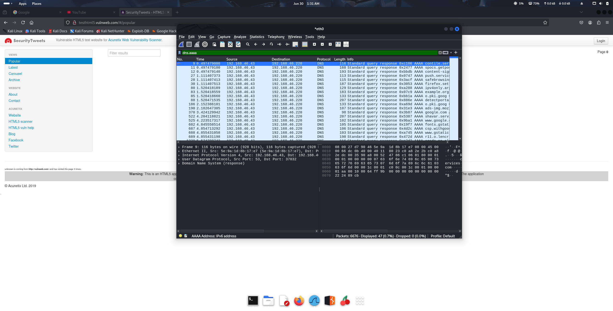

# Elevated Labs Cyber Security Internship

# Task 1
## Start Capturing packets flowing in Network
In wireshark you can pick the NIC you want to capture packet from by selecting Interface\

# Task 2
## Filtering Captured Packets
You can filter the packet in wireshark based on it's name like for HTTP is http
* HTTP Packet Capture

* TCP Packet Capture

* DNS Packet Capture

# Task 3
## Identifying protocols of captured packets
* HTTP
* TCP
* DNS
* TLS
* QUIC

# Task 4
## Export Capture Packets to File
* You can save captured packets in a file with extension .pcapng or .pcap file
* For More details you can check **Wireshark_Captured Directory**

# Task 5
## Summarizing captured packets details
* When requesting google.com the system goes through local dns query to get ip address if does dns query to dns server it will get A Records (which contains ipv4 address) and AAAA Records (which contains ipv6 address) as response 
* After getting IP address of server it will use the IP address to request server to get files realated to google.com to load it to browser
* Using TLS which is a secure protocols which will encrypt the communication the device will send HTTP request to server to load web page 
* After gettting response the files will be used to render web page to load google.com 
* After depending upon user's interaction with web page additional requests and response will be done
* QUIC (Quick UDP Internet Protocol) protocol is used in order to Optimise network speed thus reducing Network Congestions during communication
* The communication between server and client (Us) will be facilitated using TCP Packets (HTTP is part of TCP)
* This is the example for google.com but other websites also follow this for communication

